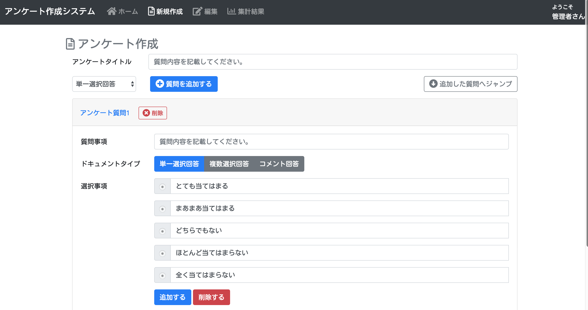
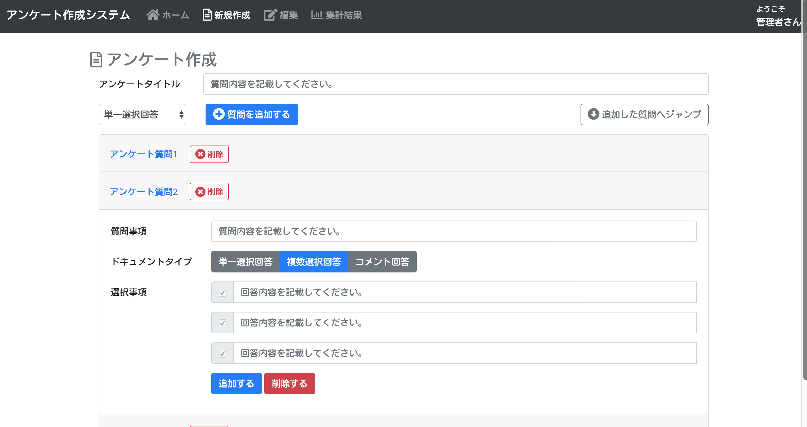
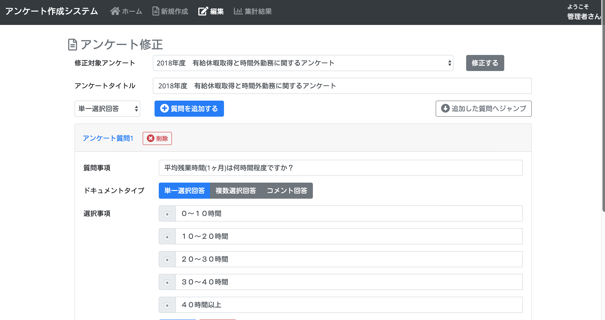
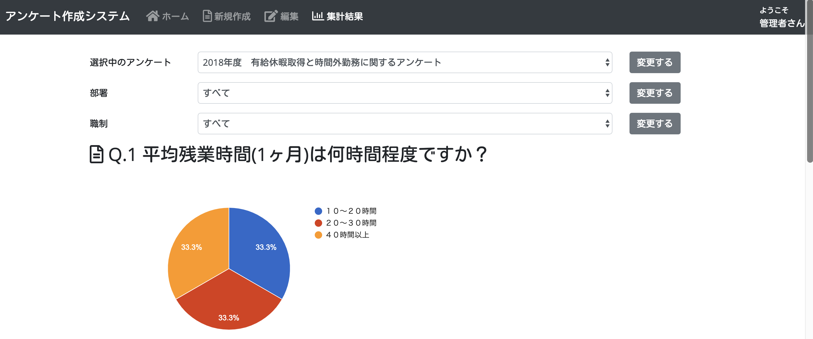
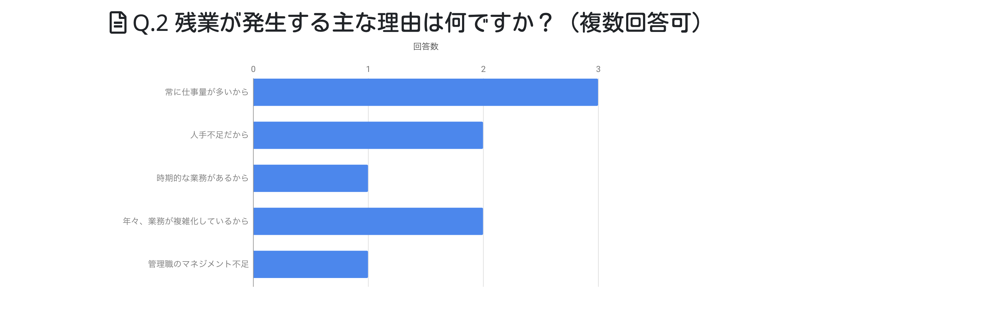

# spring-boot2-thymeleaf-polling

## Sample Web App on Heroku
### System Administrator Page
https://spring-boot2-polling.herokuapp.com/home

### User Page
https://spring-boot2-polling.herokuapp.com/questionnaire/top

## PostgreSQLの起動
デフォルトスキーマ`public`を設定する必要あり。
以下のコマンドで、日本語の文字コードを設定したpostgreSQLのDockerイメージ生成・起動を行う（テスト用なのでデータの永続化は行っていない）。
```bash
docker build -t postgres-dev -f env/postgresql/Dockerfile env/postgresql/
docker run -it --rm --name postgres-dev -e POSTGRES_USER=postgres -e POSTGRES_PASSWORD=password -e POSTGRES_DB=questionnairedb -p 5433:5432 -d postgres-dev
```

以下のコマンドで、postgreSQLのデータベースが生成されているかチェック。
```bash
docker exec -it postgres-dev psql -U postgres
postgres#=\l
```

## MariaDBの起動
文字コードを`utf8mb4_unicode_ci`に設定する必要あり。
```bash
docker run -it --rm --name mariadb-dev -e MYSQL_DATABASE=questionnairedb_test -e MYSQL_ROOT_PASSWORD=password -p 3307:3306 -d mariadb:10.3.10 --character-set-server=utf8mb4 --collation-server=utf8mb4_unicode_ci
```

## MySQLの起動
```bash
docker run -it --rm --name mysql-dev -e MYSQL_DATABASE=questionnairedb_test -e MYSQL_ROOT_PASSWORD=password -p 3307:3306 -d mysql:8.0.15 --character-set-server=utf8mb4 --collation-server=utf8mb4_unicode_ci
```

## Spring Boot2アプリの起動
### 1. Mavenを利用する場合
以下のコマンドを実行し、Webアプリケーションをビルド・起動する。
```
# For MacOS, Linux
./mvnw spring-boot:run

# For Windows
mvnw.cmd spring-boot:run
```

```
# For MacOS, Linux
./mvnw clean package

# For Windows
mvnw.cmd clean package
```

### 2. jibを使ったSpring Bootアプリの起動
```
mvn compile jib:dockerBuild
docker run --rm --name hellojib -p 8080:8080 simplepolling --link=mysql-dev --network="host"
```

## Demo











